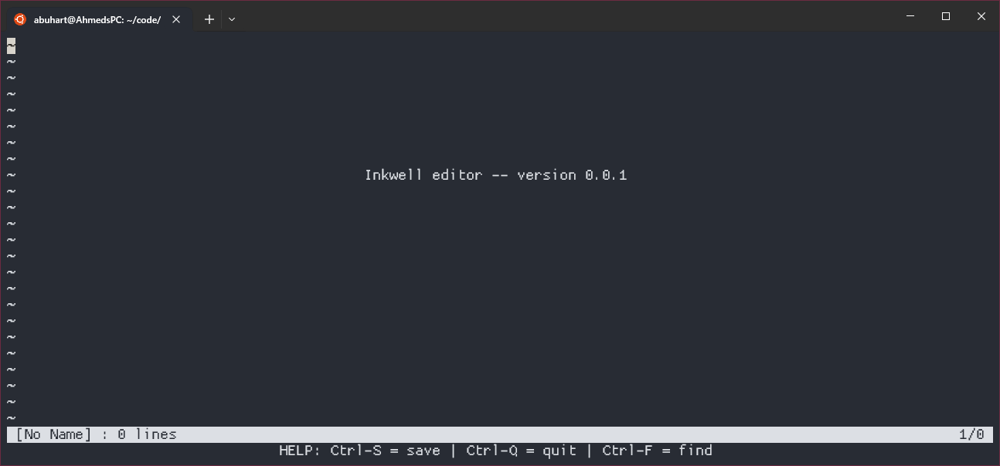
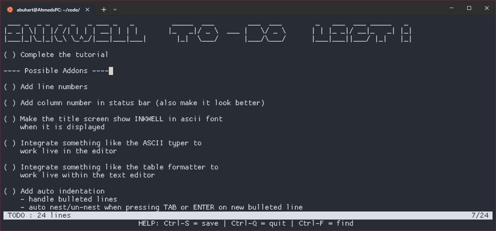

# inkwell

A text editor coded in one file of **C code**. Development of this project was mainly done as an exercise for learning more about C.

Based on a [great tutorial](https://viewsourcecode.org/snaptoken/kilo/index.html) that takes you through the step by step process of its creation.

## Building the Project

There are very little dependencies so this should build out of the box on a linux machine. Just clone the repository, and run the following commands inside of the directory:


```
    $ make                                          # builds project executable
    $ ./inkwell                                     # opens inkwell with a blank file
    $ ./inkwell <filename>                          # opens the given file in inkwell
```

## Screenshots



## Features

- opening and viewing text files
    - text navigation (Arrow Keys, HOME/END, and PAGEUP/PAGEDOWN)
- basic text editing
- searching in file (Ctrl-F)
- file saving (Ctrl-S)
    - prompts user for file name if a name is not already given

Planned additions are included in TODO
